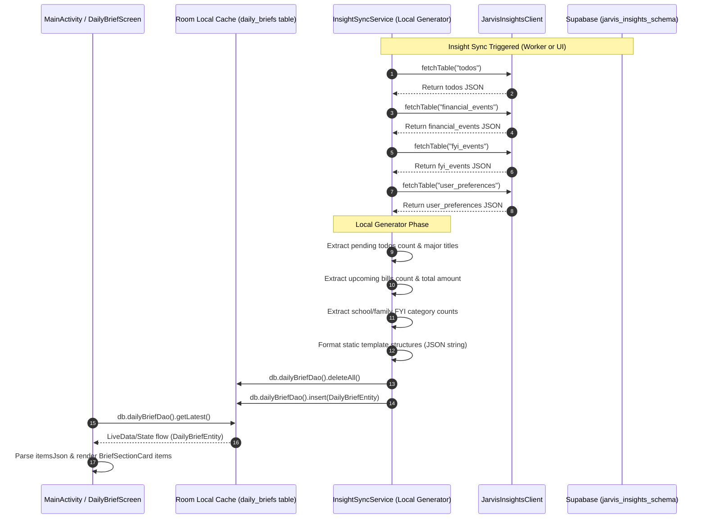

# DAILY BRIEF ARCHITECTURE ASSESSMENT v1.0

## Executive Summary & Objective

This document analyzes the current architectural flow, data access patterns, and code components of the **Daily Brief** feature in the Jarvis Android application ("Jarvis Collector"). 

In alignment with the **JARVIS Android App v1.0 Master Architecture & Design Instruction Set** and the **JARVIS Platform Anchor Document v1.0**, the Android application must function as a **presentation-only thin client**. It must not perform local intelligence summarization, brief composition, or narrative building. These processes are owned entirely by the remote Jarvis agent pipeline, which writes the final output to Supabase.

---

# Section 1 - Current Flow

Currently, the Android app generates the Daily Brief text locally. Instead of pulling compiled briefs from a remote repository, it downloads raw downstream tables (`todos`, `financial_events`, `fyi_events`, `user_preferences`), and compiles a templated text brief inside `InsightSyncService`.

### Current End-to-End Sequence Diagram

---

# Section 2 - Daily Brief Generation Logic

The logic responsible for assembling the Daily Brief resides completely inside the synchronization service layer.

### Generation Components

#### 1. Component: `InsightSyncService`
* **Function**: `syncInsights(context: Context)` (Lines 172 to 230)
* **Purpose**: Compiles a static text-based daily summary by running SQLite queries against the synced downstream Room tables, formatting them into template narratives, serializing them into a JSON array, and caching the result in the Room database.
* **Caller**: 
  * `InsightSyncWorker.doWork()` (Background periodic syncing)
  * `MainActivity.refreshInsights` / `MainActivity` via UI trigger buttons
* **Dependencies**: 
  * `JarvisDatabase` (and related DAOs: `TodoDao`, `FinancialEventDao`, `FyiEventDao`)
  * `DailyBriefEntity`
  * `org.json.JSONArray` & `org.json.JSONObject`

---

# Section 3 - Local Business Logic Detection

The following logic blocks in the Android codebase constitute forbidden local business logic violations:

1. **Pending Tasks Summary** (`InsightSyncService.kt#L179-L189`):
   * Inspects Room's `todos` table using `db.todoDao().getPending()`.
   * Assembles the string: `"You have ${pendingTodos.size} open tasks. Major items: $titles$suffix."` or a default `"You are all caught up..."` text.
2. **Financial Summary** (`InsightSyncService.kt#L191-L203`):
   * Queries `financial_events` from Room.
   * Filters for items categorized as `"bill"` or containing `"upcoming"` status.
   * Sums local currency values: `upcomingBills.sumOf { it.amount ?: 0.0 }`.
   * Generates the string: `"You have ${upcomingBills.size} upcoming bills (totaling ₹${...}). Key payments: $titles."`.
3. **FYI Circulars Summary** (`InsightSyncService.kt#L205-L217`):
   * Queries `fyi_events` from Room.
   * Counts category types (`school`, `family`, `other`) using local string matching.
   * Generates the string: `"Received ${fyiList.size} new updates today: $school school circulars, $family family updates..."`.
4. **Current Date ID Generation** (`InsightSyncService.kt#L174-L175`):
   * Formats local device time to construct the Primary Key identifier: `java.text.SimpleDateFormat("yyyy-MM-dd")`.

---

# Section 4 - Supabase Integration

Currently, the Supabase integration has **zero** communication with a remote `daily_briefs` table.

* **Current `daily_briefs` Table Usage**: Not queried.
* **Read Operations**: None.
* **Write Operations**: None.
* **Synchronization Process**: The app only fetches raw dependency tables via GET requests through `JarvisInsightsClient.fetchTable()`. 

### Architectural Determination
> [!IMPORTANT]
> **Android currently relies 100% on locally generated template content.** It does not consume remote Daily Brief records generated by the central python pipeline.

---

# Section 5 - Room Database Usage

The Room database is used as the local caching and state management system for downstream data.

### Room Database Configuration
* **Entity**: [DailyBriefEntity](file:///c:/jarvis/jarviscollector/app/src/main/java/com/pradeep/jarviscollector/model/InsightEntities.kt#L94-L100)
  * Schema:
    * `@PrimaryKey val id: String`
    * `val generatedAt: String`
    * `val version: String`
    * `val itemsJson: String` (serialized array: `[{"title": "...", "content": "..."}]`)
* **DAO**: [DailyBriefDao](file:///c:/jarvis/jarviscollector/app/src/main/java/com/pradeep/jarviscollector/database/InsightDaos.kt#L108-L121)
  * `insert(brief: DailyBriefEntity)`
  * `getLatest(): DailyBriefEntity?`
  * `getAll(): List<DailyBriefEntity>`
  * `deleteAll()`
* **Repository**: No dedicated repository class exists for the Daily Brief. `MainActivity` accesses the database directly via:
  `latestBrief = JarvisDatabase.getDatabase(context).dailyBriefDao().getLatest()`

### Architectural Determination
> [!NOTE]
> Currently, Room acts as the **Source of Truth** for the UI, but it is populated by local business logic rather than caching remote pipeline states. In the target state, Room must act strictly as a **Cache** of the remote `daily_briefs` table.

---

# Section 6 - UI Dependency Analysis

The daily brief screen is represented by [DailyBriefScreen](file:///c:/jarvis/jarviscollector/app/src/main/java/com/pradeep/jarviscollector/ui/DailyBriefScreen.kt).

### UI Hierarchies & Components
1. **`MainActivity`** (State Holder):
   * Declares `var latestBrief by remember { mutableStateOf<DailyBriefEntity?>(null) }`.
   * Queries it on startup and manual sync via `refreshInsights()`.
2. **`HomeScreen`**:
   * Inspects `briefDate = latestBrief?.generatedAt` to render status: `"Latest generated"` or `"No Briefs Synced"`.
3. **`DailyBriefScreen`**:
   * Displays the morning summary.
   * Parses `brief.itemsJson` into individual section titles and bodies.
   * Renders sections inside scrollable `BriefSectionCard` components.
4. **`BriefSectionCard`**:
   * Statelessly renders each section key-value pair.

---

# Section 7 - Architectural Gap Analysis

Comparing the current implementation against the target platform baseline highlights critical architectural deviations.

| Metric | Current State | Target State (JARVIS Contract) | Architectural Gap |
| --- | --- | --- | --- |
| **Generation Source** | Local device text template creation in `InsightSyncService` | Python `Daily Brief Agent` runs centrally on Python server | Local generation violates "presentation layer only" directive |
| **Data Ingestion** | Fetches `todos`, `financial_events`, `fyi_events` and synthesizes locally | Fetches `daily_briefs` table directly from Supabase REST API | No sync logic exists for remote `daily_briefs` table |
| **Data Format** | Custom JSON structure built on-device | LLM structured text/markdown stored directly in database | Format mapping does not handle pipeline-generated LLM outputs |
| **Local Dependencies** | Generation depends on local SQLite sync state of other tables | UI depends strictly on downloaded `daily_briefs` record | Android cannot render a brief if other sync tasks fail or are delayed |

---

# Section 8 - Refactor Recommendation

To conform to the platform architecture, we must eliminate local brief generation and transition the Android client to a pure consumer.

### Refactor Action Matrix

| Component | Current Status | Target Action | Justification |
| --- | --- | --- | --- |
| **`LocalDailyBriefGenerator`** (Inside `InsightSyncService`) | Active | **REMOVE** | Eliminates local summarization calculations and templates. |
| **`JarvisInsightsClient`** | Active | **KEEP** | Standard REST accessor. Can query the `daily_briefs` table without changes. |
| **`InsightSyncService`** | Active | **MODIFY** | Replace generation logic with `JarvisInsightsClient.fetchTable("daily_briefs")` parser. |
| **`DailyBriefEntity`** | Active | **MODIFY** / **KEEP** | Adapt schemas if necessary to map central table schema. |
| **`DailyBriefScreen`** | Active | **KEEP** | Renders static cards from parsed items. Fits the presentation layer rule perfectly. |
| **`DailyBriefRepository`** | Inactive (none) | **NEW** | Introduce a repository layer to separate UI queries from direct database access. |

---

# Section 9 - Risk Assessment

* **Data Schema Discrepancy**: If the central Supabase pipeline stores daily briefs as a raw markdown string or different column names (e.g., `content`, `summary_date`) rather than `itemsJson`, the parser in `DailyBriefScreen` will crash. The schema must be verified.
* **Sync Timing Dependencies**: If the central python pipeline has not run, `daily_briefs` table might be empty, resulting in a blank UI screen.
* **Timezone Discrepancies**: Database timestamps from Supabase must be mapped correctly to local device date strings when checking for the latest daily brief.

---

# Conclusion & Success Criteria Answers

1. **Exactly where Daily Briefs are generated**: Inside `InsightSyncService.kt` (lines 172-230) on the mobile device.
2. **Exactly where Daily Briefs are stored**: Cached locally in Room `daily_briefs` table.
3. **Exactly where Daily Briefs are displayed**: `DailyBriefScreen.kt`, linked via `MainActivity.kt`.
4. **What must be removed**: The local template building, loop aggregations, and formatting logic inside `InsightSyncService.kt`.
5. **What can be reused**: `DailyBriefScreen` Compose rendering layout, `DailyBriefDao`, and `JarvisInsightsClient` HTTP capabilities.
6. **How Android can become a pure consumer**: By querying `JarvisInsightsClient.fetchTable("daily_briefs")` during insight synchronization, parsing the resulting remote records directly into `daily_briefs` Room table, and displaying that data with no local transformations.
