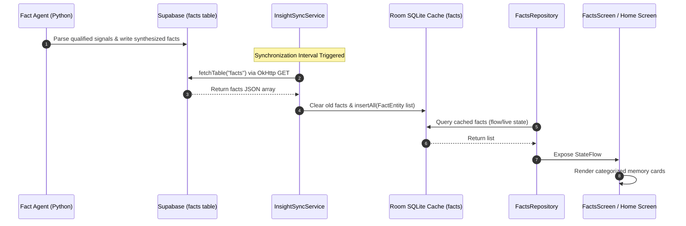

# FACTS & MEMORY ARCHITECTURE ASSESSMENT v1.0

## Objective

Assess the current state of Facts and Memory handling within the Jarvis Android application ("Jarvis Collector"). 

Jarvis Facts represent durable long-term memory elements generated by the centralized backend Fact Agent. This assessment evaluates Android's data structures, databases, repositories, sync paths, and UI readiness to build a premium, integrated memory dashboard.

---

# Section 1 - Facts Inventory

The Android codebase contains minimal, placeholder infrastructure for the Facts feature:

* **Entity**: [FactEntity](file:///c:/jarvis/jarviscollector/app/src/main/java/com/pradeep/jarviscollector/model/InsightEntities.kt#L74-L82) is registered under the `@Database` entities annotation in [JarvisDatabase.kt](file:///c:/jarvis/jarviscollector/app/src/main/java/com/pradeep/jarviscollector/database/JarvisDatabase.kt#L27).
* **DAOs**: **None**. No `FactDao` interface is implemented.
* **Repositories**: **None**. There is no repository class to manage local query flows for facts.
* **Services / Workers**: **None**. No network sync pipeline or work managers are wired to pull or push facts.
* **UI Screens**: **None**. No Compose files render facts. The dashboard only has stubs for category alerts (school, family) that fetch from the temporary `fyi_events` table instead of durable `facts`.

---

# Section 2 - Fact Agent Alignment

The validated backend **Fact Agent** compiles facts into long-term memory collections. The alignment analysis identifies key outputs:

* **Family**: Stored in remote database (family member names, relations, birthdays). **Missing on Android.**
* **Insurance**: Stored in remote database (vehicle insurance, health policies, renewal dates). **Missing on Android.**
* **Accounts**: Stored in remote database (utility accounts, financial accounts, institutions). **Missing on Android.**
* **Vehicles**: Stored in remote database (vehicle models, license plate registrations, warranty details). **Missing on Android.**
* **Contacts**: Stored in remote database (phone numbers, addresses, emails of core relations). **Missing on Android.**
* **Other**: General personal details and preferences. **Missing on Android.**

---

# Section 3 - Supabase Facts Analysis

In the remote Supabase database (`jarvis_insights_schema` profile), Facts are stored in the `facts` table:

* **Table Name**: `facts`
* **Schema**:
  | Column Name | Data Type | Nullable | Primary Key | Purpose |
  | --- | --- | --- | --- | --- |
  | `fact_id` | UUID / String | NO | YES | Unique Fact identifier |
  | `entity` | String | YES | NO | Categorized entity name (e.g. `"Tata AIG Insurance"`) |
  | `fact` | String | YES | NO | Synthesized text summary from Fact Agent |
  | `confidence` | Double | YES | NO | Verification confidence score |
  | `source_signal_id`| UUID / String | YES | NO | References original SMS/WhatsApp capture |
  | `created_at` | String (ISO) | YES | NO | Generation timestamp |
* **Relationships**: Linked to `fact_relationships` (to map graph networks like Parent-Child links) and `financial_facts` (mapping account balances).
* **Sample Record**:
  `{"fact_id":"f-299", "entity":"Honda Civic", "fact":"Registration: MH-12-XX-1234, Insurance Policy: #P9901 expiring on 2026-11-20", "confidence":0.99}`
* **Usage**: Streamlit reads it to build profile cards. Android does not currently query it.

---

# Section 4 - Android Facts Consumption

* **Downloads Facts**: **No**. `InsightSyncService` does not fetch `"facts"` or `"fact_relationships"`.
* **Caches Facts**: **No**. The Room table `facts` remains empty.
* **Displays Facts**: **No**.
* **Updates Facts**: **No**.
* **Deletes Facts**: **No**.

---

# Section 5 - Existing FactEntity Assessment

### Current `FactEntity` Status: **UNUSED**

* **Why it exists**: Generated during the project bootstrap phase as a schema definition stub.
* **Original purpose**: Intended to act as a local Room database model matching the remote Supabase table.
* **References**: Referenced only in the database entity registration list (`JarvisDatabase.kt`).
* **Future usefulness**: Can be immediately adapted for caching.

### Component Classification: **MODIFY**
> [!TIP]
> Keep `FactEntity` in the codebase. Modify it if necessary to align with the final columns of the remote Supabase `facts` table (e.g., adding category or validity fields).

---

# Section 6 - Facts Data Flow

### Target End-to-End Data Flow

---

# Section 7 - Facts Cache Assessment

Room contains stubbed support:

* **Entities**: `FactEntity` (mapped to local table `"facts"`).
* **DAOs**: **MISSING**. No interface handles database insertions, fetches, or deletions.
* **Repositories**: **MISSING**.
* **Caching Strategy**: The target strategy should be **Write-Through Cache** (Download remote records, clear old local cache, bulk insert new ones. Local updates/corrections are posted directly to `user_actions` on Supabase to trigger Agent recalculations).
* **Current Status**: Non-functional.

---

# Section 8 - Home Dashboard Readiness

To support the target Home Screen design, Facts must feed the following widgets:

1. **Fact Count**: Total unique facts cached. **Status: BLOCKED** (No DAO queries).
2. **Family Summary**: Pre-filtered list of FYI and Fact records classified under "family". **Status: PARTIAL** (Only reads temporary `fyi_events` table).
3. **Account Summary**: Number of connected banks/cards. **Status: BLOCKED** (No bank database sync).
4. **Policy Summary / Vehicle Summary**: Count of insurance policies/active vehicles. **Status: BLOCKED**.

---

# Section 9 - Facts Screen Readiness

Assessment of UI screens required for Android V2:

* **Facts Home** (Grid of categories): **NOT READY**. (Compose layout not created).
* **Family Screen**: **PARTIAL**. (Currently exists but only shows category-filtered FYI alerts rather than durable facts).
* **Insurance Screen**: **NOT READY**.
* **Account Screen**: **NOT READY**.
* **Vehicle Screen**: **NOT READY**.
* **Entity Details Screen** (Card details showing confidence scores): **NOT READY**.

---

# Section 10 - Memory Viewer Blueprint Readiness

The Memory Viewer represents the durable Jarvis memory ledger.

* **Support Status**: **NOT READY**.
* **Existing Infrastructure**: The only existing assets are the raw `FactEntity` declaration and navigation destination stubs. Everything else (Repository query methods, list composables, card filters) must be built.

---

# Section 11 - Gap Analysis

The architectural gaps preventing the Facts implementation are:

1. **Missing Schema Interface (DAO)**: No database CRUD query paths for local facts are declared.
2. **Missing Network Sync Routines**: `InsightSyncService` has no logic to retrieve the remote `facts` endpoint.
3. **Missing Category Filtering**: The local `FactEntity` lacks a `category` column to easily group memories (Family, Finance, Vehicle) on the UI.
4. **Missing Relationship Caches**: No Kotlin model exists for the `fact_relationships` table (needed to show connection graphs).

---

# Section 12 - Reuse Matrix

| Component | Purpose | Status | Reuse Recommendation | Action |
| --- | --- | --- | --- | --- |
| **`FactEntity`** | Holds fact attributes in Room DB | Unused | **MODIFY** | Retain; verify column parity with remote table. |
| **`JarvisDatabase`** | Room database manager | Active | **MODIFY** | Append `abstract fun factDao()` accessor method. |
| **`JarvisInsightsClient`** | Executes REST calls | Active | **KEEP** | Can query the `"facts"` table without modifications. |

---

# Section 13 - Recommendation Matrix

Recommended tasks for full Facts alignment:

| Component | Current Status | Recommendation | Action | Justification |
| --- | --- | --- | --- | --- |
| **`FactDao`** | Missing | **CREATE** | New Component | Required to cache fetched facts locally. |
| **`FactsRepository`**| Missing | **CREATE** | New Component | Separates the UI layers from direct Room Database queries. |
| **`FactsScreen`** | Missing | **CREATE** | New Component | Key dashboard destination displaying long-term memories. |
| **`InsightSyncService`**| Incomplete | **MODIFY** | Code Modification | Append sync queries to download `"facts"` from Supabase. |

---

# Conclusion & Success Criteria Answers

1. **Whether Facts already exist in Supabase**: Yes, compiled centrally by the Fact Agent.
2. **Whether Android consumes Facts today**: No. Sync routes and UI components are missing.
3. **Whether FactEntity is reusable**: Yes, it contains standard primary key and message text columns matching remote.
4. **Whether Facts Screen can be built immediately**: No. Requires implementing `FactDao`, `FactsRepository`, and category filters.
5. **Whether Home Dashboard can display Fact summaries**: No, blocked by missing database tables and query count methods.
6. **Whether Android aligns with the validated Fact Agent architecture**: No. The app is completely blind to long-term memory states.
