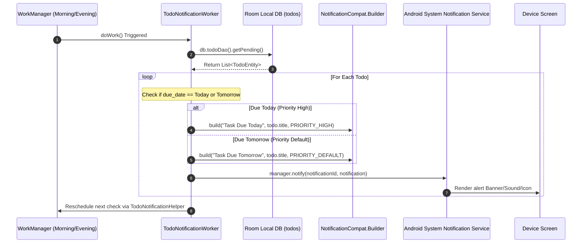

# NOTIFICATION ARCHITECTURE ASSESSMENT v1.0

## Executive Summary & Objective

The Jarvis Android application ("Jarvis Collector") functions as the primary user engagement channel for the Jarvis AI OS platform. Notifications are a core product capability to drive prompt user action on critical events.

This document assesses the application's current notification capabilities, scheduling pipelines, background workers, and channels. It reviews alignment with the **JARVIS Android App v1.0 Master Architecture & Design Instruction Set** and identifies the gaps to implement the target Android V2 notification flows.

---

# Section 1 - Notification Inventory

The Android application currently generates only one functional category of user-facing notifications: task reminders.

| Notification Name | Trigger | Source | Priority | Delivery Channel |
| --- | --- | --- | --- | --- |
| **Task Due Today** | Worker check at 7:00 AM & 6:00 PM | Local Room `todos` table query | HIGH | `todo_reminders` (Importance: HIGH) |
| **Task Due Tomorrow** | Worker check at 7:00 AM & 6:00 PM | Local Room `todos` table query | DEFAULT | `todo_reminders` (Importance: DEFAULT) |

---

# Section 2 - Notification Infrastructure

The current notification system relies on four primary components:

1. **`TodoNotificationWorker`**: A CoroutineWorker triggered by WorkManager. It queries the local Room database `todos` table, filters tasks based on target date bounds, and fires matching Android system alerts.
2. **`TodoNotificationHelper`**: A scheduling helper object that handles WorkManager initialization. It calculates millisecond delays to target execution times (7:00 AM and 6:00 PM) and registers one-off unique workers (`WORK_NAME_MORNING` and `WORK_NAME_EVENING`), self-rescheduling on completion.
3. **`NotificationChannel`**: Registers the `"todo_reminders"` channel with the OS to handle priority alerts (introduced in Android 8.0/API 26).
4. **`NotificationManagerCompat`**: The system helper service responsible for rendering and displaying notifications.

---

# Section 3 - Notification Flow Analysis

The sequence below outlines how notifications are processed and sent to the user device.

### Sequence: Todo Tasks Due Alarms

---

# Section 4 - Todo Notification Assessment

* **Trigger Logic**: Runs twice daily (7:00 AM and 6:00 PM). It uses a custom millisecond delay calculation `calculateDelayToTarget` to trigger workers.
* **Due Date Handling**: Compares `todo.due_date` against formatted date strings (`"yyyy-MM-dd"`) representing today and tomorrow.
* **Reminder Strategy**: Only alerts once for tasks due today or tomorrow. Overdue tasks are not repeated.
* **Reusability**: High. The `sendNotification` and channel registration routines are clean and easy to adapt.

### Component Classification: **MODIFY**
> [!NOTE]
> The scheduler must be modified to run at the precise 08:00 AM slot matching the Daily Brief, and handle overdue alerts.

---

# Section 5 - Notification Channel Assessment

Only one channel is currently registered in the application:

* **Channel ID**: `"todo_reminders"`
* **Importance**: `IMPORTANCE_HIGH` (for tasks due today) or `IMPORTANCE_DEFAULT` (for tasks due tomorrow).
* **Usage**: Sends active alerts for pending todos.
* **Unused Channels**: None are registered, but the target architecture requires separate channels for **Daily Briefs** and **FYI notifications**.

---

# Section 6 - Missing Notification Capabilities

The current implementation lacks most of the core capabilities outlined in the platform rules:

| Required Notification | Android Support State | Gap / Missing Component |
| --- | --- | --- |
| **Morning Daily Brief** | **MISSING** | No worker or trigger is scheduled to fire at 08:00 AM. |
| **Critical Todo** | **MISSING** | Push notifications from Supabase or high-frequency local checks are missing. |
| **Overdue Todo** | **MISSING** | No logic alerts users to tasks whose due date has passed. |
| **Financial Alert** | **MISSING** | No cashflow or bill reminders are wired to trigger notifications. |
| **Family Event** | **MISSING** | FYI category items do not generate notifications. |
| **School Event** | **MISSING** | FYI category items do not generate notifications. |
| **Insurance Renewal** | **MISSING** | Fact-based reminders do not exist. |
| **Travel Reminder** | **MISSING** | No travel check alerts are integrated. |
| **FYI Digest** | **MISSING** | No periodic compilation alerts are built. |

---

# Section 7 - Daily Brief Notification Readiness

The platform mandates a Daily Brief notification at **08:00 AM**:
* *Example*: `"You have 3 pending actions today."`

### Readiness Evaluation: **PARTIAL**
* **Existing Reusable Infrastructure**: We can repurpose `TodoNotificationHelper`'s delay calculator to run at `08:00` and trigger a `DailyBriefNotificationWorker`.
* **Missing Components**:
  * A dedicated `"daily_brief"` notification channel.
  * Integration to count open tasks in the database and construct the brief message before firing.
  * A `PendingIntent` hook to launch `DailyBriefScreen` upon clicking the notification.

---

# Section 8 - Brief Popup Readiness

The platform requires a **Daily Brief Modal Popup** to show once per day upon first app launch.

### Readiness Evaluation: **NOT READY**
* **Existing Infrastructure**: `MainActivity` has access to `latestBrief` and launches screens.
* **What Must Be Built**:
  * An App Preference tracker (e.g. `AppPreferences.hasShownBriefToday(context, dateStr)`) to prevent repeating the popup.
  * A Compose `AlertDialog` modal or full-screen Modal Bottom Sheet overlay designed into [HomeScreen.kt](file:///c:/jarvis/jarviscollector/app/src/main/java/com/pradeep/jarviscollector/ui/HomeScreen.kt) that checks preference status on launch, displays priorities, and offers "View Full Brief" vs "Dismiss".

---

# Section 9 - WorkManager Assessment

There is only one notification-related worker:
* **`TodoNotificationWorker`**:
  * *Schedule*: Triggered at 7:00 AM and 6:00 PM via unique one-off workers.
  * *Dependencies*: `TodoRepository`.
  * *Consolidation Opportunity*: Both Daily Brief notification calculations and Todo notifications can be managed inside a consolidated `DailyNotificationOrchestrator` to avoid running multiple overlapping database checks.

---

# Section 10 - User Preference Support

* **Notification Enabled/Disabled**: **MISSING**. Users cannot toggle system alerts from settings.
* **Notification Categories**: **MISSING**. Users cannot choose to disable FYI alerts while keeping Todos.
* **Reminder Times / Digest Frequency**: **MISSING**. Scheduling is hardcoded to 7:00 AM / 6:00 PM.

---

# Section 11 - Duplication Analysis

* No duplicate notification builders or helper objects exist. The codebase is clean, keeping all builders inside `TodoNotificationWorker` and scheduling inside `TodoNotificationHelper`.

---

# Section 12 - Reuse Matrix

Mapping of reusable notification assets:

| Component | Purpose | Current Status | Reuse Recommendation | Action |
| --- | --- | --- | --- | --- |
| **`TodoNotificationWorker`** | Queries database and triggers alerts | Active | **MODIFY** | Retain; refactor to include overdue check. |
| **`TodoNotificationHelper`** | WorkManager target timer scheduler | Active | **MODIFY** | Retain; adjust scheduling to align with 08:00 AM briefs. |
| **`NotificationManager` calls** | Binds channels and triggers OS alerts | Active | **KEEP** | Reuse exactly as implemented. |

---

# Section 13 - Gap Analysis

1. **Gap**: Missing `daily_briefs` Sync Dependency
   * *Impact*: Notifications cannot preview remote Daily Brief contents since the table is not synchronized.
2. **Gap**: Missing Notification Channels
   * *Impact*: System notifications cannot categorize priority levels (e.g., quiet FYI circulars vs. loud Critical Actions).
3. **Gap**: Hardcoded Scheduling Delay Logic
   * *Impact*: WorkManager scheduler handles timezones and delays via manual millisecond arithmetic that repeats, risking delayed workers if the device enters deep sleep.
4. **Gap**: Missing Settings Controls
   * *Impact*: Users cannot customize alert behaviors.

---

# Section 14 - Future Notification Blueprint Readiness

* **Daily Brief Notification**: **PARTIAL** (Requires adjusting scheduler to 8:00 AM and linking intent).
* **Critical Action Alert**: **PARTIAL** (Requires high-priority channel configuration).
* **Financial Alert**: **NOT READY** (Requires mapping event dates to schedules).
* **Family / School Alert**: **NOT READY** (Requires FYI filtering).
* **Reminder Escalation**: **NOT READY** (Requires overdue database logic).
* **Digest Notifications**: **NOT READY** (Requires aggregation logic).

---

# Conclusion & Success Criteria Answers

1. **Every notification currently generated**: Task reminders (due today/tomorrow) sent via `TodoNotificationWorker`.
2. **Every notification-related component**: `TodoNotificationWorker`, `TodoNotificationHelper`, and the `"todo_reminders"` channel.
3. **What infrastructure can be reused**: WorkManager scheduling framework, date comparison structures, and OS notification channel builders.
4. **Whether Daily Brief notifications can be added easily**: Yes. The scheduler can be adjusted to 08:00 AM, using the existing template code.
5. **Whether popup brief support can be implemented**: Yes, by adding a Compose `AlertDialog` in the Home screen state machine.
6. **What gaps exist before Android V2**: Missing channels (Daily Brief, FYI), missing target date matching for overdue tasks, and timezone sleep prevention.
