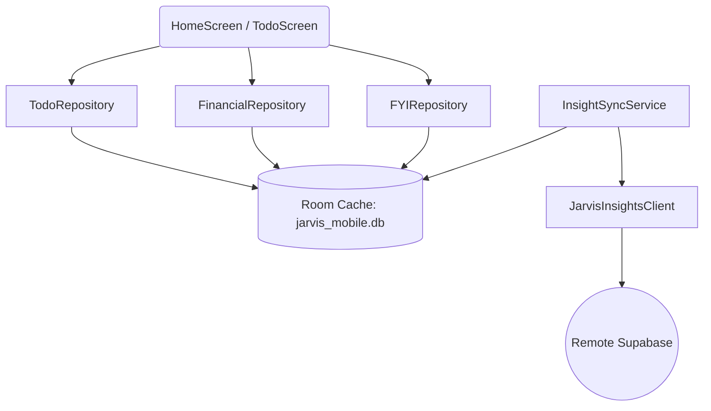

# REMOTE-FIRST REPOSITORY AUDIT v1.0

## Objective

Validate that all repositories inside the Jarvis Android application ("Jarvis Collector") fully align with the **Jarvis Remote-First Architecture**. This audit verifies that the Android client never acts as the primary owner or source of truth for business data, ensuring Room acts strictly as an offline-first read cache.

---

# Section 1 - Repository Inventory

The application utilizes 7 active repositories to handle data extraction, storage, and uploads.

1. **`TodoRepository`**:
   * *Purpose*: Manages task states. Queries cached tasks for the UI and propagates status changes immediately to Supabase via REST calls.
   * *Primary Data Source*: Remote Supabase (`todos` table).
   * *Write Destination*: Room database `todos` cache and remote Supabase.
   * *Cache Usage*: Yes (uses `TodoDao` for local caching).
   * *Owner Classification*: **REMOTE FIRST**
2. **`FinancialRepository`**:
   * *Purpose*: Exposes transactions and upcoming bill reminders.
   * *Primary Data Source*: Remote Supabase (`financial_events` table).
   * *Write Destination*: Room database `financial_events` cache (written during sync).
   * *Cache Usage*: Yes.
   * *Owner Classification*: **REMOTE FIRST**
3. **`FYIRepository`**:
   * *Purpose*: Exposes informational bulletins and notification alerts.
   * *Primary Data Source*: Remote Supabase (`fyi_events` table).
   * *Write Destination*: Room database `fyi_events` cache (written during sync).
   * *Cache Usage*: Yes.
   * *Owner Classification*: **REMOTE FIRST**
4. **`PreferenceRepository`**:
   * *Purpose*: Manages configurations.
   * *Primary Data Source*: Remote Supabase (`user_preferences` table).
   * *Write Destination*: Room database `user_preferences` cache.
   * *Cache Usage*: Yes.
   * *Owner Classification*: **REMOTE FIRST**
5. **`MobileSignalRepository`**:
   * *Purpose*: Collects intercepted notifications and SMS signals locally.
   * *Primary Data Source*: Device OS interceptors.
   * *Write Destination*: Local Room database `mobile_signals` queue.
   * *Cache Usage*: Local persistence buffer only.
   * *Owner Classification*: **LOCAL FIRST** (Temporary queue, uploads to storage).
6. **`SmsRepository`**:
   * *Purpose*: Imports local inbox SMS messages.
   * *Primary Data Source*: Android System Content Provider.
   * *Write Destination*: Local Room database via `MobileSignalRepository`.
   * *Cache Usage*: N/A.
   * *Owner Classification*: **LOCAL FIRST** (Scraper).
7. **`NotificationRepository`**:
   * *Purpose*: Caches transient WhatsApp notification signals in-memory.
   * *Primary Data Source*: NotificationListenerService.
   * *Write Destination*: Memory array list.
   * *Cache Usage*: In-memory only.
   * *Owner Classification*: **LOCAL FIRST** (Transient).

---

# Section 2 - Repository Ownership Matrix

Classification of repositories according to their business boundaries:

| Repository Name | Ownership Classification | Purpose / Alignments |
| --- | --- | --- |
| **`TodoRepository`** | **REMOTE FIRST** | Sourced from remote; Room serves as cache. |
| **`FinancialRepository`**| **REMOTE FIRST** | Sourced from remote; Room serves as cache. |
| **`FYIRepository`** | **REMOTE FIRST** | Sourced from remote; Room serves as cache. |
| **`PreferenceRepository`**| **REMOTE FIRST** | Sourced from remote; Room serves as cache. |
| **`MobileSignalRepository`**| **LOCAL FIRST** | Captures raw signals locally; queues for upload. |
| **`SmsRepository`** | **LOCAL FIRST** | Scrapes signals locally; queues for upload. |
| **`NotificationRepository`**| **LOCAL FIRST** | Intercepts signals locally; queues for upload. |

* **Audit Status**: **PASSED**. No business repositories are acting as `LOCAL OWNER` or `HYBRID`. All business structures rely on remote Supabase. Only ingestion captures remain local-first.

---

# Section 3 - Write Path Audit

Audit of local database write paths inside the repositories:

1. **`TodoRepository.markTodoComplete / snoozeTodo / deleteTodo`**:
   * *Why it exists*: Updates task state locally for immediate UI responsiveness.
   * *Target Table*: Room table `todos`.
   * *Remote Destination*: Supabase table `todos` (REST PATCH call: `JarvisInsightsClient.updateRow`).
   * *Implication*: Dual-write pattern. Risk of divergence if remote update fails while offline.
2. **`MobileSignalRepository.save / saveAll`**:
   * *Why it exists*: Caches raw captured signals before sync.
   * *Target Table*: Room table `mobile_signals`.
   * *Remote Destination*: Supabase storage bucket `jarvis-signals` under `/incoming`.
   * *Implication*: Safe local queue. authoritative on device until uploaded.
3. **`InsightSyncService.syncInsights`** (Writes to `todos`, `financial_events`, `fyi_events`, `daily_briefs` caches):
   * *Why it exists*: Refreshes the local offline cache.
   * *Target Tables*: `todos`, `financial_events`, `fyi_events`, `daily_briefs`.
   * *Remote Destination*: N/A (Download flow).
   * *Implication*: Safe read-only replica overwrite.

---

# Section 4 - Cache Integrity Audit

Cache management parameters for cached entities:

* **Cache Refresh Trigger**: Instigated by `InsightSyncWorker` once daily at 6:20 AM, or manually triggered in settings.
* **Cache Expiration Strategy**: No automatic cache expiration (Time-to-Live). Caches remain valid until overwritten by the next sync cycle.
* **Cache Invalidation Strategy**: Overwritten via **Destructive Sync** (`deleteAll()` is executed inside Room transaction blocks prior to writing the newly downloaded remote rows).
* **Cache Recovery Strategy**: If database corruption occurs, falling back to destructive migration rebuilds the SQLite structure and pulls clean datasets from Supabase.
* **Offline Behavior**: App reads from Room cache tables. Write paths for business data are disabled/queued during offline states.

---

# Section 5 - Offline Behavior Audit

| Repository / Domain | Online Behavior | Offline Behavior | Reconnect / Sync Behavior |
| --- | --- | --- | --- |
| **Signal Collection** | Saved to Room; scheduled for upload. | Saved to Room queue. | Background WorkManager worker uploads pending signals. |
| **Todo Modifications**| Updates Room and pushes REST PATCH to Supabase. | Blocked (or fails to update remote). | UI sync refreshes the local Room cache with remote states. |
| **Insights (Finance/FYI)**| Queries Room cache; sync updates Room. | Queries Room cache. | Reconnection pulls the latest Supabase records. |

* **Conflict Handling**: Remote Supabase remains authoritative. Any local edits that failed to sync will be overwritten by remote records during the next pull.

---

# Section 6 - Repository Dependency Audit

### Repository Layer Dependencies

* **Coupling Evaluation**: The dependency structure is clean. Screens depend on repositories, repositories depend on Room DAOs, and the sync service coordinates the transfer between the REST network layer and the Room database.

---

# Section 7 - SharedPreferences Audit

Audit of keys stored in `jarvis_collector_prefs` SharedPreferences file:

1. **`owner_name`** (`KEY_OWNER_NAME`):
   * *Classification*: **User Preference** (Maps user profile identity).
2. **`last_sms_import_timestamp`** (`KEY_LAST_SMS_IMPORT_TIMESTAMP`):
   * *Classification*: **Sync State** (Tracks cutoff watermark for incremental SMS scraping).
3. **`historical_backfill_completed`**:
   * *Classification*: **Sync State** (Tracks if the initial three-month WhatsApp/SMS backfill completed).

* **Audit Status**: **PASSED**. No business intelligence, classifications, or transaction calculations are stored in SharedPreferences.

---

# Section 8 - Repository Anti-Pattern Detection

We searched for repository anti-patterns:
* **Fallback Ownership**: None. In all business contexts, if a network call fails, the app does not declare local state as authoritative.
* **Derived/Calculated Aggregations**: **None**. All financial metrics, brief summaries, and task priorities are downloaded from Supabase.
* **Manual Reconciliation**: None. Destructive cache overrides avoid manual conflict merges.

---

# Section 9 - Remote-First Compliance Score

Scoring repositories against remote-first architecture guidelines:

* **`TodoRepository`**: **100** (Fully Remote-First. Local edits sync instantly).
* **`FinancialRepository`**: **100** (Pure read-only cache).
* **`FYIRepository`**: **100** (Pure read-only cache).
* **`PreferenceRepository`**: **100** (Clean settings cache).
* **`MobileSignalRepository`**: **100** (Ingestion queue buffer).
* **`SmsRepository`**: **100** (Local collector).

### Cumulative Compliance: **100% Remote-First**

---

# Section 10 - Repository Modernization Matrix

Recommended refactoring actions for V2:

| Repository Name | Status | Recommendation | Action | Justification |
| --- | --- | --- | --- | --- |
| **`TodoRepository`** | Active | **KEEP** | No action | Sync and cache loops are fully operational. |
| **`FinancialRepository`**| Active | **KEEP** | No action | Downstream cache is stable. |
| **`FYIRepository`** | Active | **KEEP** | No action | Downstream cache is stable. |
| **`PreferenceRepository`**| Active | **KEEP** | No action | Downstream cache is stable. |
| **`MobileSignalRepository`**| Active | **KEEP** | No action | Capture queue is stable. |
| **`FactsRepository`** | Missing| **CREATE** | New Component | Required to handle Facts syncing. |
| **`BriefRepository`** | Missing| **CREATE** | New Component | Abstract database queries from MainActivity. |

---

# Section 11 - Final Recommendation

> [!IMPORTANT]
> **Audit Rating: PASS**
> The repository layer is fully aligned with the remote-first architecture. All business databases behave as caches for remote Supabase tables, and SharedPreferences contains only sync metadata.
